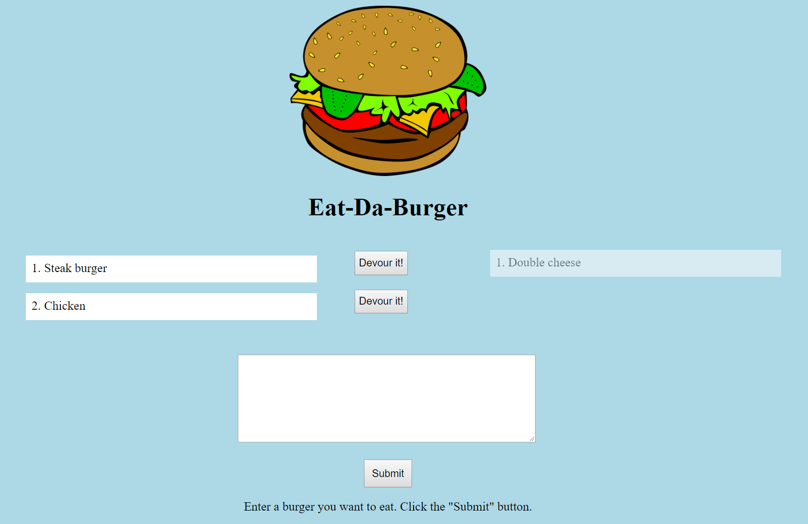

# Eat-Da-Burger

## Overview
Eat-Da-Burger is a restaurant app that lets users input the names of burgers they'd like to eat. Whenever a user submits a burger's name, the app displays the burger on the left side of the page -- waiting to be devoured. Each burger in the waiting area also has a `Devour it!` button. When the user clicks it, the burger moves to the right side of the page.

The app is deployed to Heroku. [Try it out here](https://guarded-coast-90449.herokuapp.com/).

.

### Technology used:
* MySQL
* Node
* Express
* Handlebars
* ORM
* Heroku

### App Setup

1. After cloning this repo run `npm install` to install all dependencies. 
2. In this repo there is a folder named `db` with `schema.sql` and `seeds.sql` files. Run the `schema.sql` and `seeds.sql` files in the mysql server to create a database, table and populate it with three entries.
3. Inside a folder named `config` there is a `connection.js` file. Open it and update the connection varialble with your password. 
4. Inside your terminal or Bash window run `node server js` and navigate to `localhost:3030` to view the app. 


### Directory structure

```
.
├── config
│   ├── connection.js
│   └── orm.js
│ 
├── controllers
│   └── burgers_controller.js
│
├── db
│   ├── schema.sql
│   └── seeds.sql
│
├── models
│   └── burger.js
│ 
├── node_modules
│ 
├── package.json
│
├── public
│   └── assets
│       ├── css
│       │   └── burger_style.css
│       └── img
│           └── burger.png
│   
│
├── server.js
│
└── views
    ├── index.handlebars
    └── layouts
        └── main.handlebars
```
